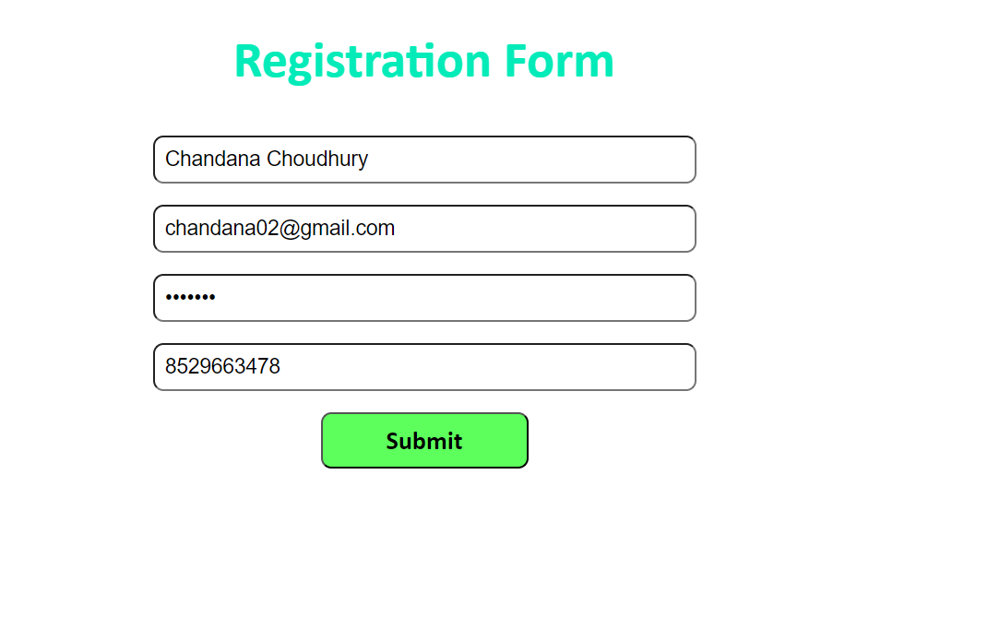

# **DOCTOR-APPOINTMENT REGISTRATION FORM**

## This project contains a simple Appointment schduling form a any Doctal requirement.

### Here the Tech Stack used is:

* `HTML,CSS,JS`
* `NodeJS` 
* `MongoDB`

## Some Key points of using this :
* `NodeJS` for backend framework for server side connection
* `MongoDB` to handle Customer Data taken by Regsitration form.
* `Frontend` handled by simple HTML,CSS page to send Real Time data to Database.

* Some More features like Home Page can be added & then redirected to this Form Page.
* Doctor Appointment System can be used where main Doctor Website page opens up & Simply an Appointment form can be taken.
# **Images of the above process when executed**

1. Filling the form details 

2. User gets Confirmation Message on Succesfully Registered

3. Data of User Stored in MongoDB with Previous Data of users

### Here we can clearly see the that data has been inserted successfully & that too with Encrypted form of Password so that it can't be breached easily

**Plz give your Valuable Suggestion to Improve it**.